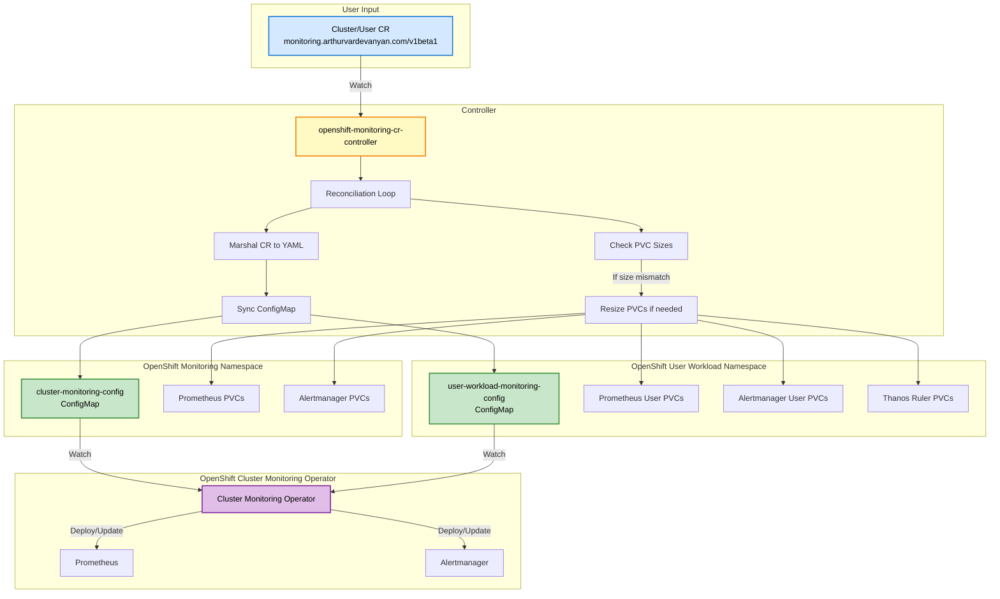

# openshift-monitoring-cr-controller

A Kubernetes controller that manages OpenShift cluster monitoring and user workload monitoring configuration as Custom Resources, instead of manually editing ConfigMaps.

## Overview

On OpenShift, cluster monitoring is configured via a `cluster-monitoring-config` ConfigMap in the `openshift-monitoring` namespace, and user workload monitoring via a `user-workload-monitoring-config` ConfigMap in the `openshift-user-workload-monitoring` namespace. Managing raw ConfigMaps with embedded YAML has several downsides:

- No schema validation — typos and invalid fields are silently accepted
- No straightforward way to track changes through GitOps tooling
- `volumeClaimTemplate` changes in the ConfigMap do not resize existing PVCs

This controller solves these problems by introducing two cluster-scoped CRDs (`Cluster` and `User`) that act as a typed, validated abstraction over those ConfigMaps. On each reconciliation the controller:

1. Marshals the CR spec into the expected ConfigMap YAML format
2. Creates or updates the corresponding ConfigMap
3. Compares `volumeClaimTemplate` storage sizes against existing PVCs and expands any that are undersized

## Architecture



## Custom Resources

Both CRDs belong to the API group `monitoring.arthurvardevanyan.com/v1beta1` and are **cluster-scoped** (not namespaced).

### `Cluster`

Must be named `cluster-monitoring-config`. Maps to the ConfigMap of the same name in `openshift-monitoring`.

| Field                   | Description                                                                                        |
| ----------------------- | -------------------------------------------------------------------------------------------------- |
| `enableUserWorkload`    | Enable user workload monitoring                                                                    |
| `prometheusOperator`    | Prometheus Operator settings (logLevel, nodeSelector, tolerations)                                 |
| `prometheusK8s`         | Prometheus settings (retention, resources, storage, externalLabels, additionalAlertmanagerConfigs) |
| `alertmanagerMain`      | Alertmanager settings (resources, storage, enableUserAlertmanagerConfig)                           |
| `kubeStateMetrics`      | kube-state-metrics settings                                                                        |
| `openshiftStateMetrics` | openshift-state-metrics settings                                                                   |
| `monitoringPlugin`      | Monitoring console plugin settings                                                                 |
| `metricsServer`         | Metrics server settings                                                                            |
| `telemeterClient`       | Telemeter client settings                                                                          |
| `thanosQuerier`         | Thanos Querier settings (resources, nodeSelector, tolerations)                                     |

### `User`

Must be named `user-workload-monitoring-config`. Maps to the ConfigMap of the same name in `openshift-user-workload-monitoring`.

| Field                | Description                                                              |
| -------------------- | ------------------------------------------------------------------------ |
| `alertmanager`       | Alertmanager settings (enabled, enableAlertmanagerConfig, storage)       |
| `prometheusOperator` | Prometheus Operator settings (logLevel, nodeSelector, tolerations)       |
| `prometheus`         | Prometheus settings (retention, enforcedSampleLimit, resources, storage) |
| `thanosRuler`        | Thanos Ruler settings (resources, storage)                               |

### PVC Reconciliation

When a `volumeClaimTemplate` is specified on a component, the controller will list PVCs in the target namespace matching the expected StatefulSet naming pattern (e.g. `prometheus-k8s-db-prometheus-k8s-*`) and patch any PVC whose current size is smaller than the desired size. This allows storage expansion without manually editing PVCs.

> **Note:** The underlying StorageClass must support volume expansion (`allowVolumeExpansion: true`).

## Example

```yaml
apiVersion: monitoring.arthurvardevanyan.com/v1beta1
kind: Cluster
metadata:
  name: cluster-monitoring-config
spec:
  enableUserWorkload: true
  prometheusK8s:
    retention: 10d
    resources:
      requests:
        cpu: 1
        memory: 4Gi
      limits:
        cpu: 3
        memory: 8Gi
    volumeClaimTemplate:
      spec:
        storageClassName: longhorn-static
        volumeMode: Filesystem
        resources:
          requests:
            storage: 40Gi
  alertmanagerMain:
    enableUserAlertmanagerConfig: false
    resources:
      requests:
        cpu: 10m
        memory: 32Mi
      limits:
        cpu: 30m
        memory: 64Mi
    volumeClaimTemplate:
      spec:
        storageClassName: longhorn-static
        volumeMode: Filesystem
        resources:
          requests:
            storage: 50Mi
  thanosQuerier:
    resources:
      requests:
        cpu: 50m
        memory: 128Mi
      limits:
        cpu: 350m
        memory: 768Mi
---
apiVersion: monitoring.arthurvardevanyan.com/v1beta1
kind: User
metadata:
  name: user-workload-monitoring-config
spec:
  alertmanager:
    enabled: true
    enableAlertmanagerConfig: true
  prometheus:
    retention: 26d
    resources:
      requests:
        cpu: 50m
        memory: 512Mi
      limits:
        cpu: 250m
        memory: 1024Mi
    volumeClaimTemplate:
      spec:
        storageClassName: longhorn-static
        volumeMode: Filesystem
        resources:
          requests:
            storage: 5Gi
  thanosRuler:
    resources:
      requests:
        cpu: 10m
        memory: 64Mi
      limits:
        cpu: 50m
        memory: 256Mi
```

## Getting Started

### Prerequisites

- Go 1.25+
- Access to an OpenShift cluster
- `kubectl` or `oc` configured with cluster-admin privileges

### Build

```sh
# Update dependencies
go get -u && go mod tidy

# Run tests and build the binary
make

# Build and push the container image with ko
make ko-build
```

### Deploy

```sh
# Install CRDs
make install

# Deploy the controller
make deploy IMG=<registry>/openshift-monitoring-cr-controller:<tag>

# Apply your monitoring configuration
kubectl apply -f sample/monitoring.yaml
```

### Remove

```sh
# Undeploy the controller
make undeploy

# Remove CRDs
make uninstall
```

### Local Development

```sh
# Install CRDs and run the controller locally
make install run
```

### Modifying the API

After editing types in `api/v1beta1/`, regenerate manifests:

```sh
make manifests generate
```

## Architecture

This project follows the Kubernetes [Operator pattern](https://kubernetes.io/docs/concepts/extend-kubernetes/operator/) and is scaffolded with [Kubebuilder](https://book.kubebuilder.io/).

```text
api/v1beta1/          # CRD type definitions (Cluster, User)
controllers/
  cluster_controller.go   # Reconciler for the Cluster CR
  user_controller.go      # Reconciler for the User CR
  helpers.go              # Shared utilities (PVC reconciliation, helpers)
config/
  crd/                # Generated CRD manifests
  rbac/               # RBAC roles and bindings
  manager/            # Controller Deployment
  overlays/default/   # Production kustomize overlay
```

### RBAC

The controller uses least-privilege RBAC:

- **ClusterRole** `manager-role` — CRUD on `Cluster` and `User` CRs
- **ClusterRole** `manager-role-config-map` — Scoped to the two specific ConfigMap names, bound via RoleBindings in each namespace
- **Role** `manager-role-cluster-pvc` / `manager-role-user-pvc` — PVC `get`/`patch` scoped by `resourceNames` to the expected StatefulSet PVC names in each namespace

### Scaffolding Reference

```sh
kubebuilder init --domain arthurvardevanyan.com --repo github.com/ArthurVardevanyan/openshift-monitoring-cr-controller
kubebuilder create api --group monitoring --version v1beta1 --kind Cluster --namespaced=false
kubebuilder create api --group monitoring --version v1beta1 --kind User --namespaced=false
```

## License

Copyright 2023.

Licensed under the Apache License, Version 2.0 (the "License");
you may not use this file except in compliance with the License.
You may obtain a copy of the License at

<http://www.apache.org/licenses/LICENSE-2.0>

Unless required by applicable law or agreed to in writing, software
distributed under the License is distributed on an "AS IS" BASIS,
WITHOUT WARRANTIES OR CONDITIONS OF ANY KIND, either express or implied.
See the License for the specific language governing permissions and
limitations under the License.
